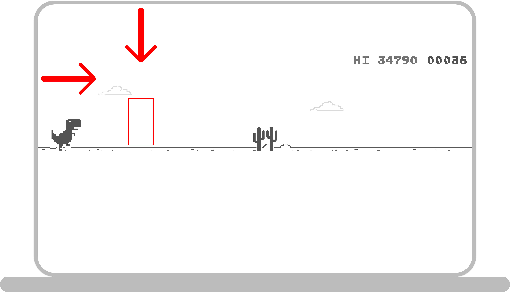
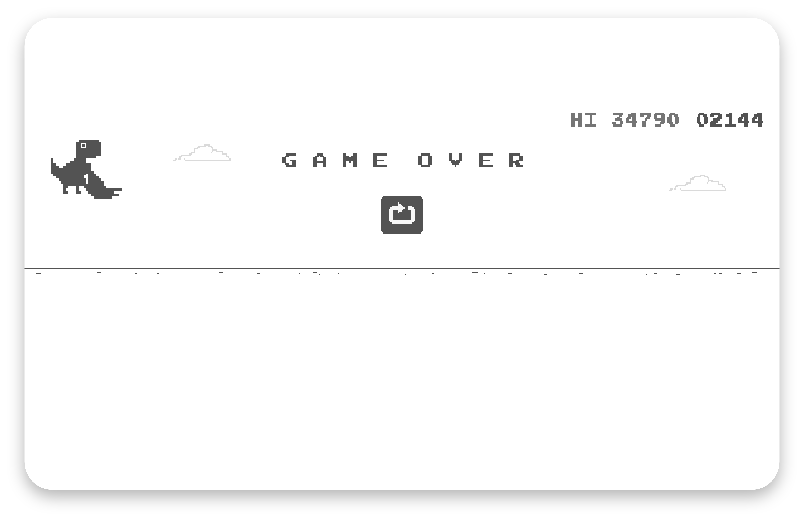

# Chrome-Dino CV 
I think all of you are found of chrome dino when your internet is down. I always wonder that How much high score one can get in [CHROME-DINO](chrome://dino) game So, I thought of making a programm in ComputerVision that can play [CHROME-DINO](chrome://dino) game and get me the highest score(IT CAN ACHIEVE).

> Note : As OpenCV is slow, it will take time to start to for instance you have to play for 2-3 seconds and then CV will start and play for you.

## Setting Up Chrome-Dino

1. ### Installation  
    First make sure that you are in **ChromedinoCV** Directory or type 
    `cd ChromedinoCV`  
    Run this command in terminal 
    `git clone https://www.github.com/sciencelabwork/ChromedinoCV.git`  
    Now Install Dependencies required by typing 
    `pip install -r requirements.txt`  
    Now to start Automation  
    `python dinoplay.py`

2. ### Generating XY-Coordinates
    > This is for fine tunning, First run the code if it works fine then no need to go for this step and it dosen't work then you need to follow the steps given below. 
    1. Go to [CHROME-DINO](chrome://dino) (Fullscreen Version) and start the game by clicking spacebar.
    2. Now measure the centimeters from left side of your screen and top of your screen   
     
    3. Multiply by 58 and set that value to top and left variable.
    4. If that dosen't work then you need to use _brute foce_ testing and setting up the value.

> Above👆 were the only Two Steps You need to Follow. Enjoy You Automation.

## High Score

Highest Score I can Achieved was ***34790*** and few minutes back I have Achieved was ***2144***. As you can see in below Screenshot 👇.

## Website To visit

* [sciencelabwork](http://www.sciencelabwork.cf)  
* [rudraspot](http://rudraspot.me)

## Contact Me

* [Instagram](https://www.instagram.com/rudra_shah_)  
* [Twitter](https://www.twitter.com/labworkscience)

"All rights reserved & logo shouldn't be remade without prior permission"
